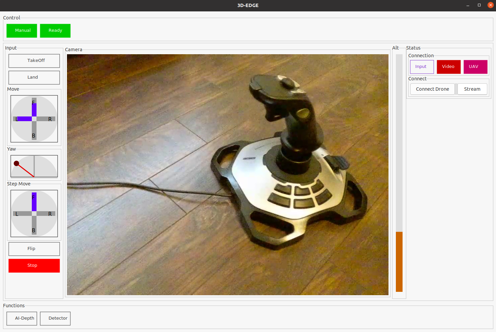

# 3DEDGE_NANOv1.0
 3DEDGE_NANO Basic -No Functions Included 

 # Installation 
 1. Install OpenCV  4.X.X (For image handling)
 2. Eigen3- Matrix Calculation
 3. gtkmm-3 -GUI is developed on GNOME GTKMM

    This software version is compatible with the TELLO drone and Logitech 3D Joystick. 
 

 

## Watch the Demo Video

